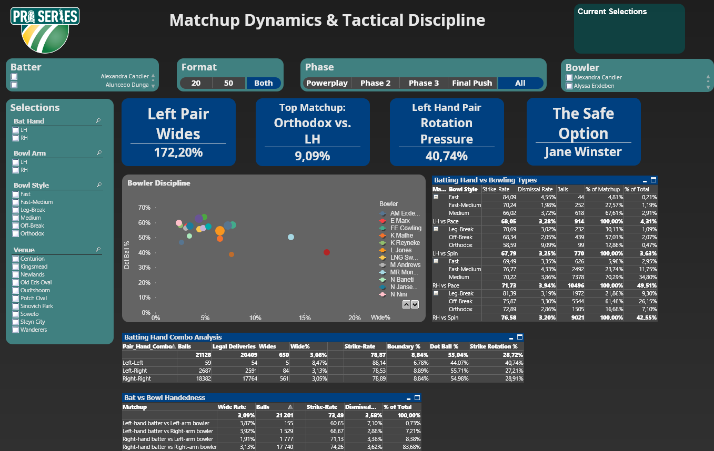
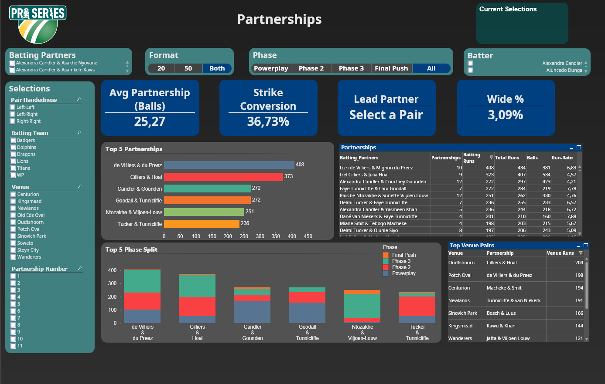
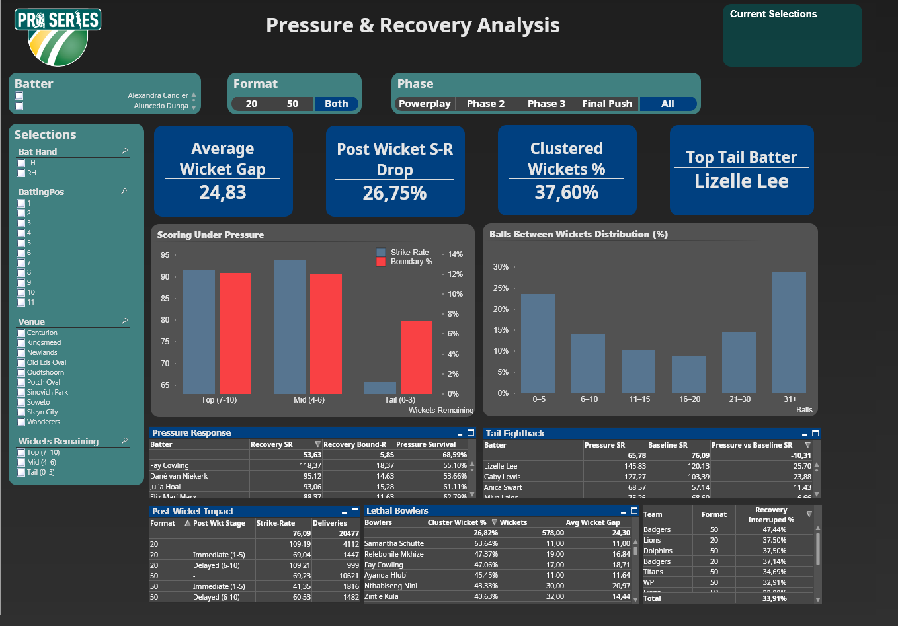

# South African Women's Domestic Cricket Analytics

A full-stack cricket analytics pipeline and dashboard covering the **Hollywoodbets Pro20** and **Pro50** competitions for South African women's domestic cricket.

Built entirely as an independent project — from raw data extraction through to a multi-tab QlikView analytics dashboard.

---

## The Problem

At the moment, no complete and consolidated ball-by-ball analytical dataset existed for South African women's domestic cricket. Two separate data sources each had part of the picture:

- The **CSA TMS API** provided structured ball-by-ball delivery data but inconsistent player naming and no partnership dimension
- **CricketArchive** provided authoritative player data and scorecards but required scraping

Neither source alone was sufficient, both had gaps in the ball-by-ball data. The pipeline combines both.

---

## Pipeline Overview

```
┌─────────────────────────────────────────────────────────┐
│  TRACK 1 — CSA TMS API (ball-by-ball)                   │
│                                                         │
│  GetComps.py                                            │
│    └─ competitions_master.csv                           │
│         └─ (manual filter) competitions.csv             │
│              └─ RunAllCompetitions.py                   │
│                   └─ BallByBall_[CompID]_[Fmt]_[Sea].csv│
└─────────────────────────────────────────────────────────┘

┌─────────────────────────────────────────────────────────┐
│  TRACK 2 — CricketArchive (enrichment + player data)    │
│                                                         │
│  PlayerDetailsExtract.py                                │
│    └─ [TournamentName].csv                              │
│         └─ NormalisePlayers.py + PlayerDesc.csv         │
│              └─ Merged_Player_Data.csv                  │
│                                                         │
│  ballbyballextract.py                                   │
│    └─ [matchid]_[innings].html                          │
│         └─ converttocsv.py + Merged_Player_Data.csv     │
│              └─ match_[match_id].csv                    │
│                   └─ ball by ball extract.qvf           │
│                        └─ BallByBallFinal.csv           │
└─────────────────────────────────────────────────────────┘

┌─────────────────────────────────────────────────────────┐
│  MERGE + PARTNERSHIPS                                   │
│                                                         │
│  CricArc CSA Merge.qvf                                  │
│    └─ MergeResult.csv                                   │
│         └─ partnerships_extract.py                      │
│              └─ partnerships_derived.csv                │
│                   └─ ProSeries_Analysis.qvs (Dashboard) │
└─────────────────────────────────────────────────────────┘
```

---

## Scripts

### `pipeline/01_competitions/GetComps.py`
Fetches all competitions from the CSA TMS API with pagination handling.

- **Input:** CSA TMS API endpoint
- **Output:** `competitions_master.csv`

### `pipeline/01_competitions/RunAllCompetitions.py`
Iterates through a manually filtered competition list, scrapes ball-by-ball data from the CSA TMS web interface using Playwright, and parses delivery-level data from the rendered HTML.

- **Input:** `competitions.csv` (manually filtered from `competitions_master.csv`)
- **Output:** `BallByBall_[CompID]_[Format]_[Season].csv` per competition

### `pipeline/02_players/PlayerDetailsExtract.py`
Scrapes player profiles from CricketArchive tournament batting pages, extracting full names, date of birth, batting style, bowling style and wicketkeeper status. Skips players already present in the merged player table to avoid redundant requests.

- **Input:** CricketArchive tournament batting URL
- **Output:** `[TournamentName].csv`

### `pipeline/02_players/NormalisePlayers.py`
Merges scraped player extract files with a manually maintained player descriptor table (`PlayerDesc.csv`). Handles compound South African surnames, derives bowling arm and action from style descriptions, and presents fuzzy-matched duplicate candidates for manual review before writing the final output.

- **Input:** `PlayerDesc.csv` + `[TournamentName].csv` files
- **Output:** `Merged_Player_Data.csv`

### `pipeline/03_ball_by_ball/ballbyballextract.py`
Scrapes CricketArchive ball-by-ball commentary HTML pages for each match in a tournament. Also extracts the fixtures table for downstream team assignment. Skips already-downloaded files to support incremental runs.

- **Input:** CricketArchive tournament page URL
- **Output:** `match_[matchid]_i[innings].html` per innings, `fixtures_[tournament].csv`

### `pipeline/03_ball_by_ball/converttocsv.py`
Parses the downloaded commentary HTML files into structured delivery-level CSV data. Resolves player names against the merged player master, assigns fielding teams using the fixtures table, and extracts dismissal methods from commentary text.

- **Input:** `match_[matchid]_i[innings].html` files + `Merged_Player_Data.csv`
- **Output:** `match_[match_id].csv` per match

### `pipeline/04_partnerships/partnerships_extract.py`
Scrapes CricketArchive scorecards to derive partnership-level data. Reconstructs which two batters were at the crease for each partnership by walking the batting order against the fall of wickets. Handles retirement events, compound surnames in dismissal records, and not-out final partnerships.

- **Input:** CricketArchive tournament page URLs
- **Output:** `partnerships_derived.csv`

---

## QlikView Layer

The final analytical layer is built in QlikView and is not included in this repository as it requires a QlikView licence to run. It consists of:

- **`ball by ball extract.qvf`** — loads and cleans the CricketArchive CSV output into a structured innings table
- **`CricArc CSA Merge.qvf`** — joins the two ball-by-ball sources on match date, team and innings, resolving naming differences between the two APIs
- **`Analysis_Script.qvs`** — the main application load script, building the full data model including ball-by-ball grain, innings summaries, batter form windows, partnership joins via `partnership_no`, phase classifications, and all calculated fields

---

## Dashboard Features

- Ball-by-ball and innings-level analysis across Pro20 and Pro50
- Partnership tracking — runs, balls, hand combinations, dismissal context
- Batter form windows — peak and current form over configurable innings ranges
- Phase analysis — powerplay, middle overs, death overs with configurable over range selection
- Player comparisons — head-to-head batting and bowling profiles with rank gauges
- Matchup analysis — batter vs bowler hand/arm combinations
- Post-wicket pressure tracking — scoring patterns in the overs following a dismissal
- Ground and venue data with geographic coordinates

---

## Dashboard Gallery

### Core Analytical Views
<table>
  <tr>
    <td><p align="center"><b>Player Comparison & Ranking</b></p></td>
    <td><p align="center"><b>Matchup Analysis</b></p></td>
  </tr>
  <tr>
    <td><p align="center"><b>Partnership Dynamics</b></p></td>
    <td><p align="center"><b>Pressure & Recovery Analysis</b></p></td>
  </tr>
</table>

<details>
<summary><b>View Additional Dashboard Sheets (Bowling, Form, Venues)</b></summary>

* **Bowling Analysis:** [Bowling Overview](images/Bowling.png) & [Bowler Comparison](images/Bowl%20Compare.png)
* **Innings Construction:** [Innings Build-up](images/Innings%20Construct.png)
* **Batter Form Windows:** [Form Analysis](images/Bat%20Form.png)
* **Venue Based Analysis:** [Venues](images/Venues.png)

</details>

## Technical Notes

**Player name normalisation** was one of the core challenges. The CSA Match Centre data, CricketArchive scorecards, and CricketArchive commentary each use different name formats for the same players. The pipeline resolves this through a combination of exact matching, fuzzy surname matching, and a manually maintained player descriptor table.

**Partnership derivation** required reconstructing batting partnerships from first principles — Neither CSA's match centre or CricketArchive publish partnership data directly. The approach walks the batting order sequentially, advancing the striker or non-striker on each dismissal by matching fall-of-wicket surnames against full scorecard names. Edge cases handled include compound surnames (`van Niekerk`, `Viljoen-Louw`), retirement events with optional return, and the final unbroken partnership in not-out innings.

**Dual-source merge** — the CSA TMS API and CricketArchive ball-by-ball data cover overlapping but not identical match sets with different levels of detail. The QlikView merge layer joins them on date, team and innings, with CSA Match Centre data as the primary source and CricketArchive providing enrichment where available.

---

## Dependencies

```
requests
beautifulsoup4
pandas
playwright
lxml
```

Install Playwright browsers after pip install:
```bash
playwright install firefox
```
